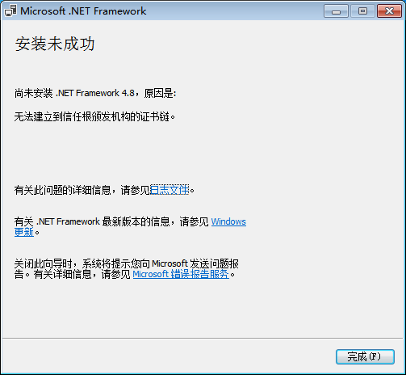
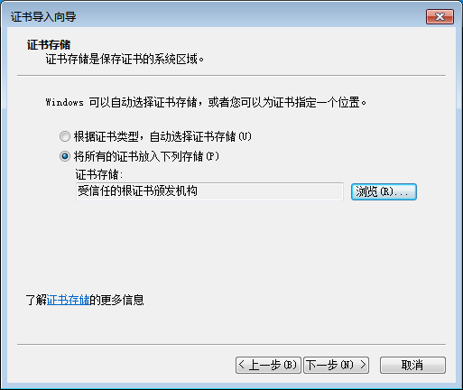
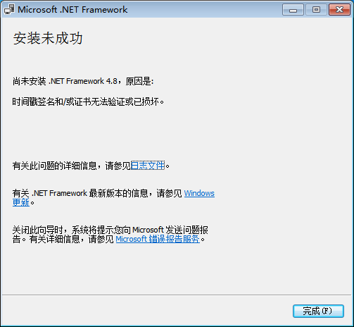
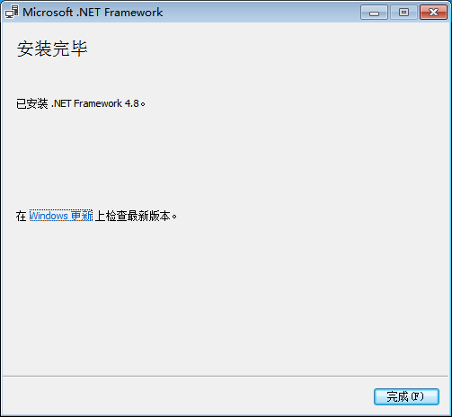

## Windows 7 系统安装

Win 7 的硬件支持到7代IU, 没有远古设备, 所以采用VMWare虚拟机安装测试.

具体IOS版本为 `cn_windows_7_ultimate_with_sp1_x86_dvd_u_677486.iso`

## 安装 .NET Framework 4.8

直接下载并安装 [.NET Framework 4.8](https://support.microsoft.com/en-us/topic/microsoft-net-framework-4-8-offline-installer-for-windows-9d23f658-3b97-68ab-d013-aa3c3e7495e0)

报错:

:::warning

无法建立到信任根颁发机构的证书链

:::

## 安装CA证书

下载CA证书并安装, 选择“将所有的证书放入下列存储”->“受信任的根证书颁发机构”

再次安装 .NET Framework 4.8

报错:

:::warning

时间戳签名和/或证书无法验证或已损坏

:::

## 安装补丁包

StackOverflow 的 [帖子](https://stackoverflow.com/questions/47176239/a-certificate-chain-could-not-be-built-to-a-trusted-root-authority/60812129#60812129) 中, 有一个评论提到

> The solution didn't work for me. I got "the timestamp signature and/or certificate could not be verified or is malformed." error.
> For that error I got, need KB4474419 and KB4490628 updates for SHA-2 code signing support.

查看微软的[日志](https://www.catalog.update.microsoft.com/home.aspx), 都是 A security issue has blah blah 的安全更新(~~仿佛是微信的更新日志: 修复一些已知问题~~)

但是检索 KB4474419, 有[网页](https://cc.csmu.edu.tw/p/406-1028-55126,r740.php?Lang=zh-tw)提到该补丁包提供了SHA-2代码签名支持.

安装上述两个补丁包之后, 再次安装 .NET Framework 4.8, 成功!

