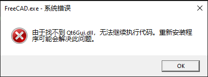
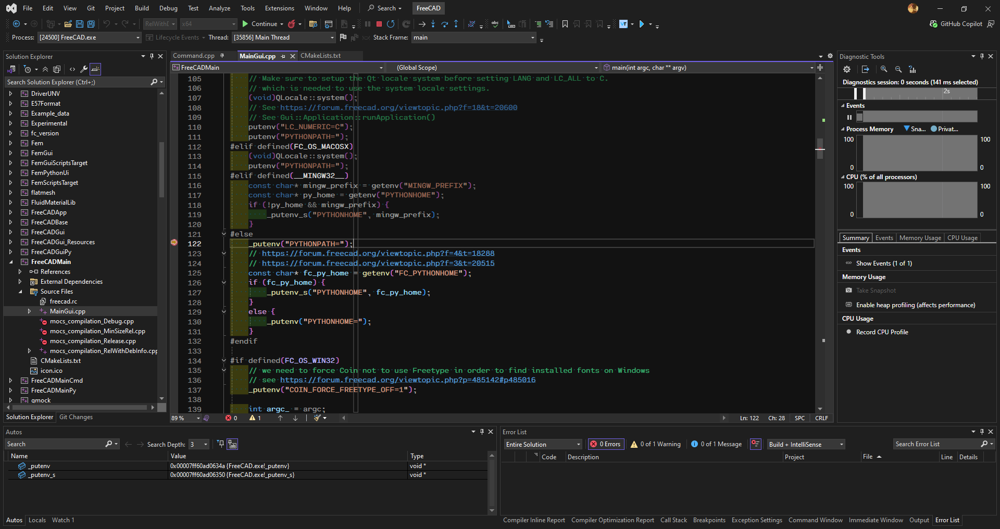

## 1. 构建环境准备

在 Windows 上编译 FreeCAD，安装并配置：
- **Visual Studio 2022 Community**
  - 勾选：`Desktop development with C++`、`C++ CMake tools for Windows`
- ~~**CMake (3.31.10)**~~
  - ~~注意：4.0+ 版本会导致 `Coin-4.0.2` 报错（提示 CMake < 3.5 兼容性已移除）。~~
- **CMake (3.27.9)**
  - 注意：3.31 版本有大量 `Policy CMP0175 is not set` 警告，虽然不影响编译, 还是降级到 3.27.9 图个清净.
- **7-Zip**
  - 7z的压缩包肯定用7-Zip来解压啦.

## 2. 源码与依赖获取

### 2.1 下载源码
基于 release 1.0.2 版本：
```bash
cd D:\Gitee
git clone https://github.com/FreeCAD/FreeCAD.git
git checkout tags/1.0.2
```

### 2.2 更新子模块 (Submodule)
```bash
cd D:\Gitee\FreeCAD
git submodule update --init --recursive
```

### 2.3 准备 LibPack
- 下载地址：FreeCAD-LibPack Releases -> `LibPack-1.0.0 Version 3.0.0`
- 解压路径：`D:\Gitee\LibPack-1.0.0-v3.0.0-Release`

## 3. CMake 构建配置

### 3.1 目录结构
采用 out-of-source build，手动创建 `FreeCAD-build` 文件夹：
```text
D:\Gitee\
├─ FreeCAD\
├─ FreeCAD-build\
└─ LibPack-1.0.0-v3.0.0-Release\
```

### 3.2 CMake GUI 设置
- **Source**: `D:/Gitee/FreeCAD`
- **Build**: `D:/Gitee/FreeCAD-build`
- **Generator**: `Visual Studio 17 2022`, `x64`
- **LibPack 路径**: 设置 `FREECAD_LIBPACK_DIR` 指向解压目录。
- **依赖搬运配置**: 重新编译的时候发现这几个选项不见了, 不是刚需
    - 勾选以下项以自动复制 DLL：
    - [x] `FREECAD_COPY_DEPEND_DIRS_TO_BUILD`
    - [x] `FREECAD_COPY_LIBPACK_BIN_TO_BUILD`
    - [x] `FREECAD_COPY_PLUGINS_BIN_TO_BUILD`


## 4. Visual Studio 编译踩坑

### 4.1 编译流程
- 打开 `FreeCAD.sln`，选择 `RelWithDebInfo` 配置进行编译。

### 4.2 运行报错记录

进入 FreeCAD-build 文件夹, 打开 FreeCAD.sln, 选择 RelWithDebInfo, 开始编译.

```
========== Build: 143 succeeded, 0 failed, 0 up-to-date, 0 skipped ==========

========== Build completed at 02:38 PM and took 26:51.720 minutes ==========
```

编译完成后, 设置 FreeCADMain 为启动项, F5

:::info
找不到ft5.dll, Qt6Widgets.dll, Qt6Gui.dll, Qt6Core.dll
:::




Visual Studio 不会自动将 LibPack 里的 DLL 复制到生成的 bin 目录中, 返回CMake, 勾选:

- [x] FREECAD COPY DEPEND DIRS TO BUILD
- [x] FREECAD COPY LIBPACK BIN TO BUILD
- [x] FREECAD COPY PLUGINS BIN TO BUILD


然后重新Configure, Generate, 编译, 这三个选项是 FreeCAD CMake 脚本中专门为 LibPack 的用户设计的自动搬运工具

然后重新Configure, Generate, 编译, 这三个选项是 FreeCAD CMake 脚本中专门为 LibPack 的用户设计的自动搬运工具, 会自动将 LibPack 里的 DLL 复制到生成的 bin 目录中.

修改之后, 再次编译, 此时编译生成的目录为 `D:\Gitee\FreeCAD-build\bin\RelWithDebInfo`, 但是上述三个脚本搬运的 DLL 文件位于 `D:\Gitee\FreeCAD-build\bin` 目录下, 配置中添加:

```
Environment Variables: 
PATH=D:\Gitee\FreeCAD-build\bin;%PATH%
QT_PLUGIN_PATH=D:\Gitee\FreeCAD-build\bin
```

编译完成后, 保持 FreeCADMain 为启动项, F5

:::info
This application failed to start because no Qt platform plugir could be initialized. Reinstalling the application may fix this problem.
:::


Qt 在 EXE 同级目录下的 platforms 文件夹里找插件，此时 EXE 位于 `D:\Gitee\FreeCAD-build\bin\RelWithDebInfo`, 而platforms文件夹位于 `D:\Gitee\FreeCAD-build\bin`, 找不到 qwindows.dll 等qt插件, 配置更新为:

```
Environment Variables: 
PATH=D:\Gitee\FreeCAD-build\bin;%PATH%
QT_PLUGIN_PATH=D:\Gitee\FreeCAD-build\bin
```

编译后报错 
:::info
During initialization the error "No module named 'freecad"" occurred
:::


## 5. 脱坑方案：INSTALL 部署调试

### 5.1 执行安装 (Install)
通过 CMake 的 INSTALL 功能将分散的组件合并：
- `CMAKE_INSTALL_PREFIX` 设置为 `D:/Gitee/FreeCAD-install`。
- 在 VS 中运行 `INSTALL` 项目。

### 5.2 调试环境配置
修改 `FreeCADMain` 项目属性：
- **Command**: `D:\Gitee\FreeCAD-install\bin\FreeCAD.exe` (指向安装目录)
- **Working Directory**: `$(ProjectDir)`
- **Environment**: 清空之前的手动 PATH 配置。


**记录**: 采用该方案后，F5 可正常启动并挂载调试器。


顺利打上断点, 能够调试了



☕☕