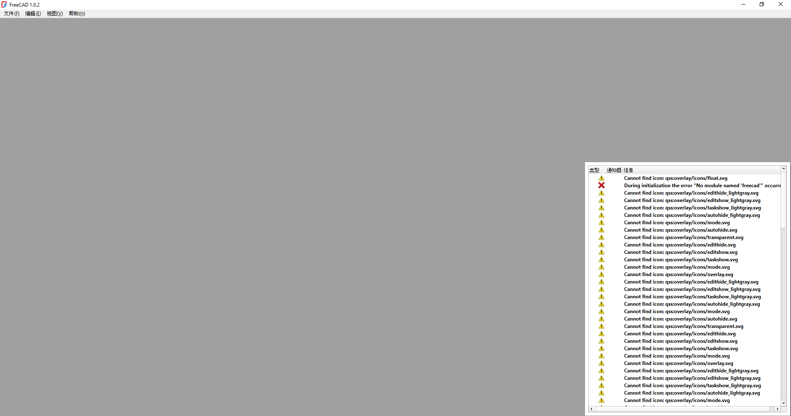

## 构建环境

在Windows上编译FreeCAD, 安装:
- Visual Studio 2022 Community
  - 勾选：
    - [x] Desktop development with C++
    - [x] C++ CMake tools for Windows
- CMake（勾选“Add to PATH”省事）
  - 选择3.31.10 (3.x即可)
  - 4.0 之后的版本太新了会报错
    ```
    CMake Error at .../Coin-4.0.2/coin-config.cmake:1 (cmake_minimum_required):
    Compatibility with CMake < 3.5 has been removed from CMake.
    ```
- 7-Zip

## 下载源码

基于 release 1.0.2 版本进行二次开发

```bash
cd D:\Gitee
git clone https://github.com/FreeCAD/FreeCAD.git
git checkout  tags/1.0.2
```

## 下载并解压 LibPack

对应编译的1.0.2版本, 到 FreeCAD-LibPack 的 Releases 下载 LibPack-1.0.0 Version 3.0.0

解压到 D:\Gitee\LibPack-1.0.0-v3.0.0-Release

## 子模块 submodule

```bash
cd D:\Gitee\FreeCAD
git submodule update --init --recursive
```

## 编译输出目录

采用 out-of-source build

文件结构：
```bash
D:\Gitee\
├─ FreeCAD\
├─ FreeCAD-build\
├─ LibPack-1.0.0-v3.0.0-Release\
```
新建文件夹 FreeCAD-build
```bash
mkdir D:\Gitee\FreeCAD-build
```

## CMake 配置

使用GUI操作,打开 CMake, 设置

- Where is the source code: → D:/Gitee/FreeCAD
- Where to build the binaries: → D:/Gitee/FreeCAD-build

点击 Configure, 选择
- Generator: → Visual Studio 17 2022
- Platform: → x64

Configure, 报错之后，找到并设置 LibPack 路径
- FREECAD_LIBPACK_DIR → D:/Gitee/LibPack-1.0.0-v3.0.0-Release

然后重新 Configure


提示

```
=================================================
Now run 'cmake --build D:/Gitee/FreeCAD-build' to build FreeCAD
=================================================
```

直接Generate, `Generating done (12.2s)`, 完成cmake配置.

## Visual Studio 编译

进入 FreeCAD-build 文件夹, 打开 FreeCAD.sln, 选择 RelWithDebInfo, 开始编译.

========== Build: 143 succeeded, 0 failed, 0 up-to-date, 0 skipped ==========
========== Build completed at 02:38 PM and took 26:51.720 minutes ==========

编译完成后, 设置 FreeCADMain为启动项, F5

找不到ft5.dll, Qt6Widgets.dll, Qt6Gui.dll, Qt6Core.dll


Visual Studio 不会自动将 LibPack 里的 DLL 复制到生成的 bin 目录中, 返回CMake, 勾选:

- [x] FREECAD COPY DEPEND DIRS TO BUILD
- [x] FREECAD COPY LIBPACK BIN TO BUILD
- [x] FREECAD COPY PLUGINS BIN TO BUILD
  
然后重新Configure, Generate, 编译, 这三个选项是 FreeCAD CMake 脚本中专门为 LibPack 的用户设计的自动搬运工具, 会自动将 LibPack 里的 DLL 复制到生成的 bin 目录中.

修改之后, 再次编译, 此时编译生成的目录为 `D:\Gitee\FreeCAD-build\bin\RelWithDebInfo`, 但是上述三个脚本搬运的 DLL 文件位于 `D:\Gitee\FreeCAD-build\bin` 目录下, 配置中添加:

```
Environment Variables: 
PATH=D:\Gitee\FreeCAD-build\bin;%PATH%
```

QT_PLUGIN_PATH=D:\Gitee\FreeCAD-build\bin


Qt 在 EXE 同级目录下的 platforms 文件夹里找插件，此时 EXE 位于 `D:\Gitee\FreeCAD-build\bin\RelWithDebInfo`, 而platforms文件夹位于 `D:\Gitee\FreeCAD-build\bin`, 找不到 qwindows.dll 等qt插件, 配置更新为:

```
Environment Variables: 
PATH=D:\Gitee\FreeCAD-build\bin;%PATH%
QT_PLUGIN_PATH=D:\Gitee\FreeCAD-build\bin
```

编译后报错 `During initialization the error "No module named 'freecad"" occurred`



## 问题分析

目前遇到的所有报错（DLL找不到、Qt插件报错、Python模块缺失），都是因为 Visual Studio 的多配置构建目录结构与 FreeCAD CMake 预期的运行时目录结构不匹配.

## 解决方案

执行 CMake 的 INSTALL , 将所有散落在不同文件夹的 EXE、DLL、Mod、Python 脚本合并到一个标准的 FreeCAD 目录结构中.

CMake GUI 中找到变量 CMAKE_INSTALL_PREFIX, 修改为 `D:/Gitee/FreeCAD-Install`.

Configure, Generate.

然后在 VS 中，右键 FreeCADMain → Properties → Debugging, 设置 Command 为安装目录下的 EXE 路径：`D:\Gitee\FreeCAD-Install\bin\FreeCAD.exe`.

Working Directory 保持为 $(ProjectDir) 即可, 同时清空之前配置的Environment Variables。


此时F5, VS 会编译代码，然后启动安装目录下的 EXE，同时挂载调试器, 成功启动 FreeCAD.

