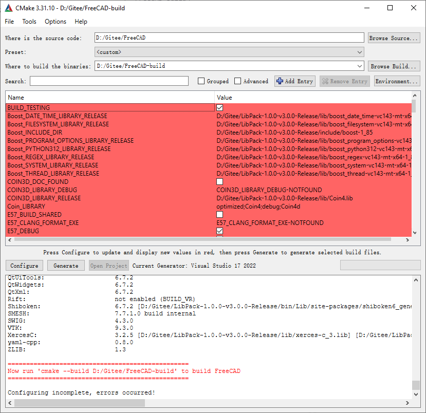
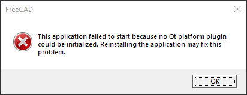
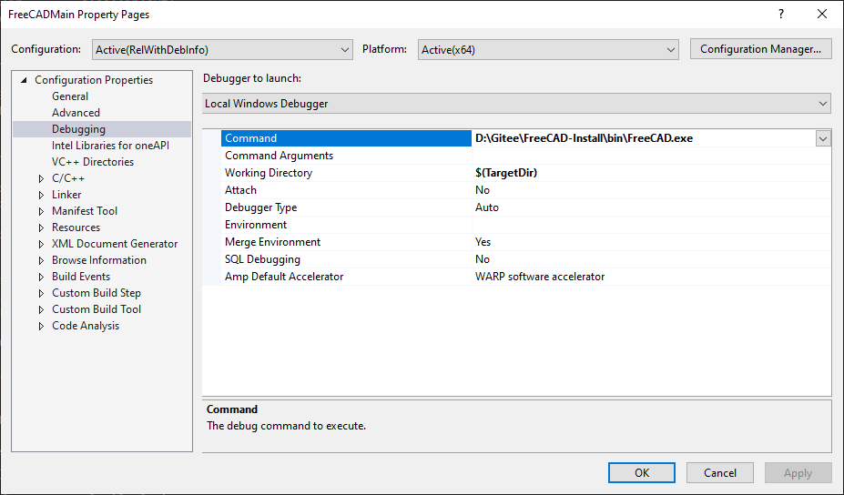
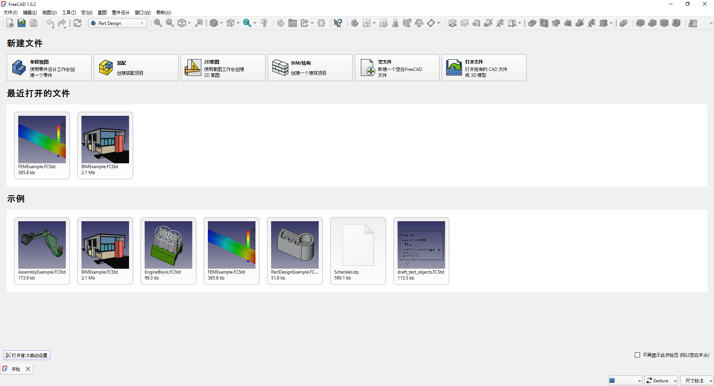

## 1. 构建环境准备

在 Windows 上编译 FreeCAD，安装并配置：
- **Visual Studio 2022 Community**
  - 勾选：`Desktop development with C++`、`C++ CMake tools for Windows`
- **CMake (3.31.10)**
  - 注意：4.0+ 版本会导致 `Coin-4.0.2` 报错（提示 CMake < 3.5 兼容性已移除）。
- **7-Zip**

## 2. 源码与依赖获取

### 2.1 下载源码
基于 release 1.0.2 版本：
```bash
cd D:\Gitee
git clone https://github.com/FreeCAD/FreeCAD.git
git checkout tags/1.0.2
```

### 2.2 更新子模块 (Submodule)
```bash
cd D:\Gitee\FreeCAD
git submodule update --init --recursive
```

### 2.3 准备 LibPack
- 下载地址：FreeCAD-LibPack Releases -> `LibPack-1.0.0 Version 3.0.0`
- 解压路径：`D:\Gitee\LibPack-1.0.0-v3.0.0-Release`

## 3. CMake 构建配置

### 3.1 目录结构
采用 out-of-source build，手动创建 `FreeCAD-build` 文件夹：
```text
D:\Gitee\
├─ FreeCAD\
├─ FreeCAD-build\
└─ LibPack-1.0.0-v3.0.0-Release\
```

### 3.2 CMake GUI 设置
- **Source**: `D:/Gitee/FreeCAD`
- **Build**: `D:/Gitee/FreeCAD-build`
- **Generator**: `Visual Studio 17 2022`, `x64`
- **LibPack 路径**: 设置 `FREECAD_LIBPACK_DIR` 指向解压目录。
- **依赖搬运配置**:
  勾选以下项以自动复制 DLL：
  - [x] `FREECAD_COPY_DEPEND_DIRS_TO_BUILD`
  - [x] `FREECAD_COPY_LIBPACK_BIN_TO_BUILD`
  - [x] `FREECAD_COPY_PLUGINS_BIN_TO_BUILD`



## 4. Visual Studio 编译与初期问题

### 4.1 编译流程
- 打开 `FreeCAD.sln`，选择 `RelWithDebInfo` 配置进行编译。

### 4.2 运行报错记录 (F5)
- **DLL 缺失**: 找不到 `ft5.dll`, `Qt6Widgets.dll` 等。
- **原因**: CMake 搬运的 DLL 位于 `bin/`，而 VS 生成的 EXE 位于 `bin/RelWithDebInfo/`，二者层级不一致。
- **临时尝试**: 在环境变量中添加 `PATH` 和 `QT_PLUGIN_PATH` 指向 `bin/`，但仍报 `No module named 'freecad'` 错误。





## 5. 终态解决方案：INSTALL 部署调试

### 5.1 执行安装 (Install)
通过 CMake 的 INSTALL 功能将分散的组件合并：
- `CMAKE_INSTALL_PREFIX` 设置为 `D:/Gitee/FreeCAD-Install`。
- 在 VS 中运行 `INSTALL` 项目。

### 5.2 调试环境配置
修改 `FreeCADMain` 项目属性：
- **Command**: `D:\Gitee\FreeCAD-Install\bin\FreeCAD.exe` (指向安装目录)
- **Working Directory**: `$(ProjectDir)`
- **Environment**: 清空之前的手动 PATH 配置。



**记录**: 采用该方案后，F5 可正常启动并挂载调试器。

