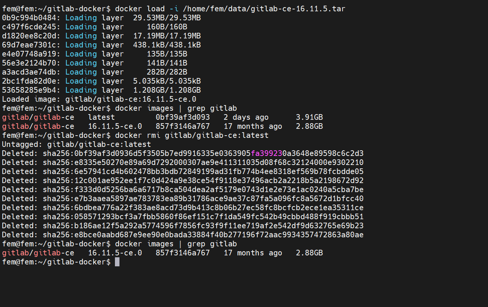
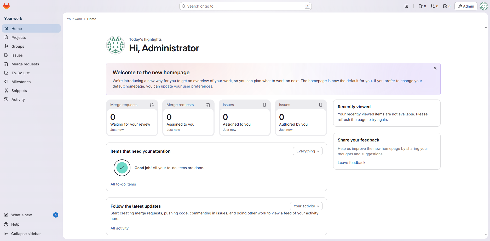

## 系统环境

使用 `cat /etc/os-release` 可以查看系统信息, 确认系统为 "Ubuntu 24.04.3 LTS".

然后 `df -h` 和 `lsblk` 查看网管给我分配的硬盘资源, 熟悉的指令, 安装arch的时候使用过这俩.

```yml
fem@fem:~$ df -h
Filesystem             Size  Used Avail Use% Mounted on
tmpfs                  1.6G  1.3M  1.6G   1% /run
/dev/sda2               98G  6.8G   87G   8% /
tmpfs                  7.9G     0  7.9G   0% /dev/shm
tmpfs                  5.0M     0  5.0M   0% /run/lock
/dev/mapper/vg0-lv--0  492G   44K  467G   1% /data
tmpfs                  1.6G   12K  1.6G   1% /run/user/1000
fem@fem:~$ lsblk
NAME        MAJ:MIN RM  SIZE RO TYPE MOUNTPOINTS
loop0         7:0    0 50.9M  1 loop /snap/snapd/25577
loop1         7:1    0 66.8M  1 loop /snap/core24/1225
loop2         7:2    0 13.9M  1 loop /snap/slcli/2957
sda           8:0    0  100G  0 disk
├─sda1        8:1    0    1M  0 part
└─sda2        8:2    0  100G  0 part /
sdb           8:16   0  500G  0 disk
└─vg0-lv--0 252:0    0  500G  0 lvm  /data
```

> 磁盘设备文件是以 /dev/sdX 的形式出现的

## 准备 Docker 环境

`sudo apt install -y docker.io docker-compose` 安装 Docker 和 Docker Compose.

然后 `docker --version` 和 `docker-compose --version` 查看版本确认安装成功.

```bash
fem@fem:~$ docker --version
docker-compose --version
Docker version 28.2.2, build 28.2.2-0ubuntu1~24.04.1
docker-compose version 1.29.2, build unknown
```

给当前用户 `$USER` 加 Docker 权限 `sudo usermod -aG docker $USER` , ssh重连, 可以避免每次都输入密码.

## 安装GitLab镜像

被网管告知服务器网络连接各种受限, 只能在本地Windows上安装Docker Desktop, 拉取镜像, 然后通过ftp上传到服务器

新老版本选一个下载(最后还是选择了latest, 版本号18.5)
- `docker pull gitlab/gitlab-ce:latest`
- ~~`docker pull gitlab/gitlab-ce:16.11.5-ce.0`~~

:::note

~~配置Pages的过程中一直在502和404之间徘徊, 报错丢给AI的解决方案越来越离谱, 提出重装之后GPT推荐了这个版本~~

:::

:::note

16.11.5版本的runner一直授权失败, `The scheduler failed to assign job to the runner, please try again or contact system administrator`, 怀疑是和最新的runner 18.7.0不兼容, 重装回最新版本的GitLab

:::

等待拉取完成之后, `docker images | grep gitlab` 查看镜像ID, 

然后 
- `docker save gitlab/gitlab-ce:latest -o gitlab-ce-latest.tar` 
- `docker save gitlab/gitlab-ce:16.11.5-ce.0 -o gitlab-ce-16.11.5.tar`

保存为tar文件, 通过堡垒机的SFTP上传到服务器.

`docker load -i gitlab-ce-latest.tar` 加载镜像.



用回 latest 起容器: 

```bash
sudo docker run -d \
  --hostname fem.xxx.com \
  --name gitlab \
  --restart always \
  -p 8090:80 \
  -p 443:443 \
  -p 2222:22 \
  -v /data/gitlab/config:/etc/gitlab \
  -v /data/gitlab/logs:/var/log/gitlab \
  -v /data/gitlab/data:/var/opt/gitlab \
  gitlab/gitlab-ce:latest
```

等待

## 配置SSH证书

网管丢给我一个zip, 里面是`.pem`和`.key`文件, 阿里云的证书一般是这个形式, 密钥对（*.pem）和私钥文件（key）, 自己部署啥也不会, 核心就是跟着GPT说的一步步来

```bash
mkdir -p /data/gitlab/ssl
cd /data
unzip nginx.zip -d /data/gitlab/ssl
```

这里受限只能通过堡垒机上传, ftp权限被限制在了home目录下的用户中, 新建的data目录位于`\home\fem\data`, 以为在`\etc\data`, 导致半天找不到文件, 被自己狠狠蠢到

执行

```bash
sudo chmod 700 /data/gitlab/ssl
sudo chmod 600 /data/gitlab/ssl/*.key
```

说是因为GitLab 要求 SSL 目录权限为 700, 私钥权限必须 600, 否则 GitLab Nginx 不会加载.

重装注意备份一下证书, 并且重新配置权限
```bash
sudo chmod 600 /data/gitlab/config/ssl/xxx.com.pem
sudo chmod 600 /data/gitlab/config/ssl/xxx.com.key

sudo chown root:root /data/gitlab/config/ssl/xxx.com.pem
sudo chown root:root /data/gitlab/config/ssl/xxx.com.key
```

## 配置GitLab

配置好了证书, 开始修改rb文件里面的配置, 第一次用nano编辑器, 下面有提示真不错, 退出只需要 `Ctrl+O, Enter, Ctrl+X` , 之前只用过vim的 `Esc + :wq`

重装的时候使用了备份的rb文件, `sudo docker exec -it gitlab ruby -c /etc/gitlab/gitlab.rb` 检查配置文件是否正确, 然后 `sudo docker exec -it gitlab gitlab-ctl reconfigure` 重新配置

至此GitLab在局域网内可以访问了☕



## 配置 GitLab Runner

GitLab 服务端跑起来了, 但还得配 Runner 来自动构建我的 Docusaurus 文档网站. 全是内网离线环境, 真正的折磨开始. 

### 安装 Runner 容器

还是老规矩, 服务器没网, 只能在本地 Windows 拉取镜像, 打包, 上传, 加载. 

* `docker pull gitlab/gitlab-runner:latest`
* `docker save gitlab/gitlab-runner:latest -o gitlab-runner.tar`
* 上传服务器 → `docker load -i gitlab-runner.tar`

启动 Runner 容器, 挂载 Docker : 

```bash
sudo docker run -d --name gitlab-runner --restart always \
   -v /srv/gitlab-runner/config:/etc/gitlab-runner \
   -v /var/run/docker.sock:/var/run/docker.sock \
   gitlab/gitlab-runner:latest

```

### 注册 Runner

在 GitLab 网页端 `Settings → CI/CD → Runners` 拿到 token, 然后进容器注册. 这一步真的是被坑惨了. 

:::tip

之所以会有latest→16.11.5→latest的切换, 是因为16.11.5的runner无法授权, 重装回latest, 最后检查发现授权失败的原因是我直接复制了GitLab Web上的命令, token因为回车换行导致错误无法授权, 第二次重装才发现这个问题人都麻了

:::

```bash
sudo docker exec -it gitlab-runner gitlab-runner register
# url填 https://fem.xxx.com
# executor 选 docker
# default image 填 node:20-alpine (伏笔, 后面细说)

```

### 修改 config.toml

刚开始跑 CI 的时候, 一直报错 `cannot run ssh` 或者 `unable to access`. 
原因很复杂: 

1. 镜像里没有 git/ssh 客户端. 
2. Docker 容器内部解析不了宿主机的 `fem.xxx.com` 域名. 
3. 就算是解析了, 容器访问宿主机 IP 也容易被防火墙拦. 

还得是Gemini , 修改 `/srv/gitlab-runner/config/config.toml`, 改完记得 `gitlab-runner restart`. 

```toml
[[runners]]
  # ... 其他配置
  # 【关键1】强制使用 HTTPS 克隆, 绕过 SSH 密钥配置, 直接用 Token 拉代码
  clone_url = "https://fem.xxx.com"
  
  # 【关键2】跳过自签名证书验证
  environment = ["GIT_SSL_NO_VERIFY=true"]

  [runners.docker]
    # 【关键3】打通容器与宿主机网络
    # 将域名指向 Docker 网桥网关 IP (通常是 172.17.0.1), 而非宿主机局域网 IP
    # 这样容器内部就能访问到 GitLab 了, 速度还快
    extra_hosts = ["fem.xxx.com:172.17.0.1"]
    pull_policy = "if-not-present"

```

## Docusaurus 依赖

这是最崩的一步. Docusaurus 新版强制要求 Node.js >= 20, 而且我的服务器是离线的, `npm install` 根本跑不通. 

### 手动搬运 Node 镜像

服务器拉不了镜像, Runner 跑起来一直报错 image not found. 
解决办法: 本地拉取 `node:20-alpine` → save → 上传 → load. 简单粗暴. 

### 跨平台依赖的坑 (Windows → Linux)

因为服务器离线, 在`.gitignore`中注释掉了`node_modules`, 把 `node_modules` 提交到了 git 仓库里. 首先是权限报错: 

- **Permission Denied**: Windows 上传上去的 `node_modules/.bin/docusaurus` 在 Linux 下没有执行权限. 
- 解决: 在 `.gitlab-ci.yml` 里手动加 `chmod +x`. 

然后是依赖版本的不匹配: 
- **Arch Mismatch**: 项目用了 `jieba` 分词插件, 本地 Windows 安装的是 win32 二进制包, 传到服务器 Docker (Alpine Linux) 里直接傻眼, 报错找不到 `linux-x64-musl`. 
- 解决: npm 以为我在 Windows 不需要 Linux 包, 不给我下. 我只能手动 `npm pack @node-rs/jieba-linux-x64-musl` 下载压缩包, 解压后强行塞进 `node_modules` 里提交上去. 


### 最终的 CI 脚本

折腾了一天, 终于绿了（Passed）. 

```yaml
image: node:20-alpine # 手动导入的镜像

pages:
  stage: deploy
  script:
    - echo "开始构建 Docusaurus..."
    # 离线模式, 不再尝试联网下载
    - npm install --prefer-offline --no-audit
    
    # 修复 Windows 上传后的权限丢失问题
    - chmod +x node_modules/.bin/docusaurus
    
    - npm run build
    
    # GitLab Pages 规范: 必须输出到 public 目录
    - rm -rf public
    - mv build public
  artifacts:
    paths:
      - public
  only:
    - main

```

## 配置 GitLab Pages

构建成功了, 但访问不到网页. 又是配置的问题. 

### 修改 gitlab.rb

继续改 `gitlab.rb`, 开启 Pages 功能. 

```ruby
# 指定 Pages 的访问地址, 注意这是子域名模式的根域名
pages_external_url "http://pages.xxx.com:8090"
gitlab_pages['enable'] = true
pages_nginx['ssl_enable'] = false

```

重载配置: `sudo docker exec -it gitlab gitlab-ctl reconfigure`. 

### Docusaurus 配置

因为是内网, 联系网管帮我配置好了DNS的解析

```cmd
C:\Users\ppll>nslookup random-test.pages.xxx.com
服务器:  dns.xxx.com
Address:  10.33.20.110

名称:    random-test.pages.xxx.com
Address:  10.33.20.164
```

然后在项目的 Deploy → Pages 中查看 `Your Pages site is live at http://qt-328a52.pages.xxx.com:8090`, 这个怪怪的链接 Gemini 说是 GitLab 的 “唯一域名 (Unique Domain)” 功能.

于是对应修改 Docusaurus 的配置文件 `docusaurus.config.js`

```js
url: 'http://qt-328a52.pages.xxx.com:8090',
baseUrl: '/',  // 改成根路径
```

访问 http://manual.pages.xxx.com:8090/qt/，页面终于出来了！🎉


